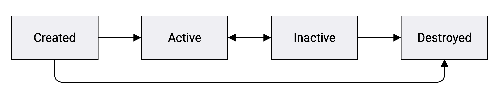

### Introduction {#introduction}

Like other frameworks, Typescene doesn't just display your application as a static document — it captures events and updates the UI when needed, which allows users to interact with your application.

This means Typescene has to work out at all times which 'view' should be displayed, incorporate your data into this view, update UI elements when needed, and call the correct event handlers in your application. All of this is done with the help of a single class, which is at the core of Typescene's architecture: the [`Component`](/docs/ref/Component) class.

Components (instances of `Component`) are just like regular objects, but provide additional infrastructure to emit and handle events, observe changes, and link to other components in ways that enforce a consistent state of the application's data and UI.

---

__Note:__ *this guide is a long read. It may take 15-30 minutes to work your way through, and you may need to refer back to it later*.

It's a good idea to read through this guide once, then get some practical experience by following along with [Your first project](/docs/guides/first), and come back to this guide afterwards for a deeper understanding.

---

### The ManagedObject class {#managedobject}

The [`ManagedObject`](/docs/ref/ManagedObject) class is the _base class_ for many other classes in the Typescene API, including `Component`. We refer to all instances as 'managed objects', which *includes* components.

Components are managed objects, but not all managed objects are components: other classes that derive from `ManagedObject` are used to create lists and other data structures.

#### Unique ID
The first property that's set on all managed objects is [`managedId`](/docs/ref/ManagedObject#ManagedObject:managedId), which is simply a read-only unique ID:

```typescript
import { Component } from "typescene";
class MyClass extends Component { /* ... */ }
class SomethingElse extends Component { /* ... */ }

let a = new MyClass();
let b = new SomethingElse();
a.managedId  // number
b.managedId  // different number
```

### Events {#events}

A key feature that powers Typescene's _event-driven_ architecture is the ability to 'emit' events from any managed object.

* Events can be emitted using the [`emit(...)`](/docs/ref/ManagedObject#ManagedObject:emit) method on an object.
* Events are instances of [`ManagedEvent`](/docs/ref/ManagedEvent). Events have a `name` property (a CamelCased string, e.g. `Change`, `Click`, `FocusOut`), and possibly other properties to communicate information about the event. These are considered read-only, so the same instance can be emitted more than once.

```typescript
import { Component, ManagedEvent, CHANGE } from "typescene";

class Foo extends Component {
  doSomething() {
    // ... do something useful here ...
    this.emit(new ManagedEvent("Bar"));
    this.emit("Bar");  // same
    this.emit(CHANGE);  // imported event
  }
}
```

Calling the `doSomething` method above causes 3 events to be emitted: two events named `Bar`, and a `Change` event. The [`CHANGE`](/docs/ref/CHANGE) event object is created by Typescene itself and is often reused to signal that some kind of change occurred in the object's internal state.

The easiest (but rather limited) way to handle events is by adding an event handler to the class itself, using the static [`handle`](/docs/ref/ManagedObject#ManagedObject:handle) method:

```typescript
Foo.handle({
  Bar() {
    // handle Bar events, `this` is a Foo instance
    console.log("Bar on " + this.managedId);
  },
  Change() {
    console.log("Change event handled");
  }
})

let foo = new Foo();
foo.doSomething();
// > Bar on 18
// > Bar on 18
// > Change event handled
```

These handlers are invoked for events that are emitted from any instance of this class (or derived classes). Alternatively, events can be handled using managed child references or observers, as explained below.

### State {#state}

_Life cycle management_ is another core feature of `ManagedObject`. Components and other managed objects are in one of the following states, as reflected by the read-only [`managedState`](/docs/ref/ManagedObject#ManagedObject:managedState) property.


{:.fullWidthImage}

* Newly created objects start out in a __Created__ state.
* Objects can be _activated_ using the [`activateManagedAsync`](/docs/ref/ManagedObject#ManagedObject:activateManagedAsync) method. What 'active' means could be determined by the object (class) itself, although it's mostly used for *active composition* (see below). All objects emit the [`ACTIVE`](/docs/ref/ACTIVE) event when they enter the __Active__ state.
* The [`deactivateManagedAsync`](/docs/ref/ManagedObject#ManagedObject:deactivateManagedAsync) method transitions objects from Active to __Inactive__ and emits the [`INACTIVE`](/docs/ref/INACTIVE) event afterwards.
* The [`destroyManagedAsync`](/docs/ref/ManagedObject#ManagedObject:destroyManagedAsync) method transitions objects to a __Destroyed__ state and emits the [`DESTROYED`](/docs/ref/DESTROYED) event. Activated objects are always inactivated first.

All of these transitions are asynchronous: objects are in 'Activating' / 'Deactivating' / 'Destroying' states while `async` methods run to perform any actions associated with a state change.

> __Note:__ Asynchronous state transitions are implemented using standard JavaScript Promises, which were introduced in ES6. TypeScript includes support for asynchronous methods using the `async` and `await` keywords.

```typescript
class Foo extends Component {
  async activateMe() {
    // transition to active state (async)
    await this.activateManagedAsync();
    console.log("Foo is now active: " + this.managedId);
  }

  // this method is called while activating:
  async onManagedStateActivatingAsync() {
    await super.onManagedStateActivatingAsync();
    console.log("Foo is activating: " + this.managedId);
  }
}
```

Notice how the `activateMe` method _waits for_ the state change to succeed, which involves calling the `async onManagedStateActivatingAsync` method and waiting for it to finish. Throwing an exception from this method would cancel the state transition.

If we call `activateMe` normally for more than one instance, the transitions will happen at the same time, in the background:

```typescript
let foo1 = new Foo();
let foo2 = new Foo();
foo1.activateMe();
foo2.activateMe();
// > Foo is activating: 16
// > Foo is activating: 17
// > Foo is now active: 16
// > Foo is now active: 17
```

There are a total of 5 `async` methods to handle state transitions:

* `onManagedStateActivatingAsync` — object is activating
* `onManagedStateActiveAsync` — object has been activated
* `onManagedStateDeactivatingAsync` — object is deactivating
* `onManagedStateInactiveAsync` — object has been deactivated
* `onManagedStateDestroyingAsync` — object is being destroyed

Note that there is __no__ 'onManagedStateDestroyedAsync' method, since the object is considered to be in an invalid state after being 'destroyed' anyway, and should not be used.

---

### Managed references {#references}

Along with managed objects, events, and states, Typescene also manages _references_ between components and other managed objects.

As a rule, properties on one component that refer to another component (or managed object) should be decorated with the [`@managed`](/docs/ref/managed) decorator — or one of the other 'managed reference' decorators described below.

```typescript
import { Component, managed, managedChild } from "typescene";

class Customer extends Component {
  constructor (public name: string) {
    super();
  }

  updated?: Date;  // not managed

  @managed
  salesRep?: Person;  // managed reference

  @managedChild
  primaryContact?: Person;  // managed reference
}

class Person extends Component {
  constructor (public name: string) {
    super();
  }
}
```

The `Customer` class in this example contains two managed references — properties that are *decorated* with `@managed*`. These decorators add property setters to 'manage' the reference, and enforce consistency during runtime:

* Managed reference properties can't take any other values. Setting a managed reference property to anything other than `undefined` or a valid managed object reference causes a `TypeError`.
* If a referenced object gets destroyed (i.e. transitions to the 'Destroyed' state), the referencing property is automatically reset to `undefined`.

This means that managed reference properties always contain a valid reference to an object that is not yet destroyed.

#### Managed child references
Managed *child* references, such as the `Customer.primaryContact` reference in the above example, enforce strict parent-child relationships — also known as __has-a__ relationships, e.g. each Customer component _has_ a primary contact person component, a UI Component object _has_ other components. The [`@managedChild`](/docs/ref/managedChild) decorator adds the following checks:

* Child objects can have only one parent at the same time. If another `@managedChild` reference property was already set to the same (child) object, that property is automatically set to `undefined` first, i.e. the child object _moves_ between parent objects, because the __has-a__ relationship cannot apply to both objects at the same time.
* If a `@managedChild` reference property is set to a new value (including `undefined`), the previously referenced child object is automatically destroyed.
* All child objects of a destroyed managed object are automatically destroyed, too.

A reference to the current parent object (if any) can be obtained using [`getManagedParent()`](/docs/ref/ManagedObject#ManagedObject:getManagedParent). To get a reference to the parent _component_ (which may be different if the component is part of a managed list, for example — refer to Collections below), use the [`getParentComponent`](/docs/ref/Component#Component:getParentComponent) method.

```typescript
let cust = new Customer("Acme Corp");
cust.primaryContact = new Person("John Doe");
cust.salesRep = new Person("Jane Parker");
cust.primaryContact.getManagedParent()  // => cust
cust.salesRep.getManagedParent()  // => undefined

// moving a *child* object removes it from the parent
let other = new Customer("Conto Sol Ltd");
other.primaryContact = cust.primaryContact;
cust.primaryContact  // => undefined (moved)

// ...others can be referenced more than once
other.salesRep = cust.salesRep;
cust.salesRep  // => Jane Parker (not moved)
```

#### Event propagation
Just like in the DOM (in a Web browser), it often makes sense for events to _propagate_ or 'bubble up' from a low-level component to its parents. This allows events to be handled in a broader context, where a parent component can manipulate other components as well.

In Typescene this doesn't happen automatically, but you can handle and/or re-emit events that were emitted on child components (see [`@managedChild`](/docs/ref/managedChild)) using the [`propagateChildEvents`](/docs/ref/ManagedObject#ManagedObject:propagateChildEvents) method on the parent component. Calling this method without any arguments causes _all_ events from child components to be propagated, but you can also specify a list of event classes or a function to restrict which events are propagated.

```typescript
import { Component, ManagedChangeEvent, managedChild } from "typescene";

class Company extends Component {
  constructor(public name: string) {
    super();

    // use a function to control propagation:
    this.propagateChildEvents(e => {
      if (e.name === "RequestCallBack") {
        // return an event here to emit it:
        return e;
      }
      if (e instanceof ManagedChangeEvent) {
        this.updated = new Date();
        return e;
      }
    });
  }

  @managedChild
  primaryContact?: Person;
  // ...
}

let cust = new Company("Foo");
cust.primaryContact = new Person("John Doe");
cust.primaryContact.emit("RequestCallback");
// => emits the same event on `cust`
cust.primaryContact.emit(CHANGE);
// => ditto, and sets `updated` property
```

---

### Observers {#observers}

So far, we've seen two methods for handling events: the static `handle` method for events emitted on the same class, and the `propagateChildEvents` method for events emitted by managed child objects.

A more powerful way to deal with events, which also allows you to handle _property changes_, is to add an __observer__ to your class:

* Managed objects can be observed by an observer class. An *instance* of the observer class is created for each instance of the target class. A reference to the target instance is passed to the observer's constructor.

```typescript
import { Component } from "typescene";

class ExhibitA extends Component { }

class MyObserver {
  constructor(public readonly target: ExhibitA) {
    // new observer instance for a new target instance
  }
}

// observe *all* instances of ExhibitA:
ExhibitA.observe(MyObserver);
```

The static [`observe`](/docs/ref/ManagedObject#ManagedObject:observe) method is available on component classes, as well as any class that directly or indirectly extends `ManagedObject` (the _target_ class).

On the observer class:

* Methods such as `onActive`, `onInactive`, and `onClick` are called when an __event__ with that name is emitted by the target. In addition, the `onEvent` method is called for _all_ events, while the `onChange` method is called for all events that are instances of [`ManagedChangeEvent`](/docs/ref/ManagedChangeEvent).
* Methods such as `onFooChange` are called when the __value of a property__ `foo` changes.
* Asynchronous handler methods such as `onFooChangeAsync`, or `onActiveAsync` (names ending with -Async) are invoked _asynchronously_. For property changes, async handlers are invoked only once after each series of changes or events that occur before the handler is called. Events are handled one by one, in order, but only after all the code after the orignal `emit` call has run.

```typescript
import { Component, ManagedChangeEvent,
  managed, managedChild, rateLimit, CHANGE } from "typescene";

class Customer extends Component {
  constructor (public name: string) {
    super();

    // propagate change events:
    this.propagateChildEvents(ManagedChangeEvent);
  }
  @managed salesRep?: Person;
  @managedChild primaryContact?: Person;
}
class CustomerObserver {
  constructor (public readonly customer: Customer) { }
  onNameChange() {
    console.log("Customer is named " +
      this.customer.name);
    this.customer.emit(CHANGE);
  }
  async onNameChangeAsync() {
    console.log("Eventually, the name is " +
      this.customer.name);
  }
  onSalesRepChange() {
    if (!this.customer.salesRep) return;
    console.log("Sales rep changed to " +
      this.customer.salesRep.name);
    this.customer.emit(CHANGE);
  }
  onPrimaryContactChange() {
    console.log("Primary contact changed");
    this.customer.emit(CHANGE);
  }
  @rateLimit(50)
  async onChangeAsync(e: ManagedChangeEvent) {
    console.log("Change (rate limited)");
  }
}
Customer.observe(CustomerObserver);
```

Notice how some events are handled synchronously, immediately after emitting the event, while others are handled asynchronously after all code has run. Additionally, the `onChangeAsync` method is _rate limited_ using [`@rateLimit`](/docs/ref/rateLimit), which means it's only invoked at most once within a limited time frame:

```typescript
let cust = new Customer("Acme Inc");
// > Customer is named Acme Inc
cust.primaryContact = new Person("John Doe");
// > Primary contact changed
cust.salesRep = new Person("Jane Parker");
// > Sales rep changed to Jane Parker
cust.name = "Acme Industries Ltd";
// > Customer is named Acme Industries Ltd
// > Eventually, the name is Acme Industries Ltd
// > Change (rate limited)
```

Refer to the documentation for [`observe`](/docs/ref/ManagedObject#ManagedObject:observe) for more details about observers, property changes and event handling.

#### Observing managed references
Managed reference properties can be observed just like other properties, using observer methods such as `onPrimaryContactChange` above. However, emitting a [`ManagedChangeEvent`](/docs/ref/ManagedChangeEvent) on a referenced object __also__ invokes the observer method. This is useful in cases where you're not only interested in changes to the object _reference_, but also in changes to the object itself.

```typescript
let newContact = new Person("Denise Jones");

// change the actual property value:
cust.primaryContact = newContact;
// > Primary contact changed

// emit a ManagedChangeEvent (CHANGE):
newContact.name = "Denise Doe-Jones";
newContact.emit(CHANGE);
// > Primary contact changed
```

Other (non-change) events on referenced objects can be observed as well. Refer to the documentation for [`@onPropertyEvent`](/docs/ref/onPropertyEvent) for details.

---

### Collections {#collections}

If we need a list of components we _could_ simply use an array:

```javascript
class Department extends Component {
  people: Person[] = [];
}

let dep = new Department();
dep.people.push(new Person("John Doe"));
dep.people.push(new Person("Jane Parker"));
```

However, this way we'd have no way to handle events that might be emitted on these `Person` instances, or check the consistency of this data structure. Also, JavaScript arrays can have gaps, duplicate elements, and lack runtime type checks, which means we need to be really careful every time we use the objects in this array.

To solve these issues, Typescene provides the [`ManagedList`](/docs/ref/ManagedList) class, which is purpose-built to contain an ordered set of components and/or other managed objects:

* Managed lists cannot contain gaps, nor duplicate items (i.e. you can't add the same component to the same list twice).
* Managed lists can be restricted so that they only accept instances of a certain class.
* Components are automatically removed from managed lists when they are destroyed.
* Managed lists can be observed for changes: events are emitted for additions, removals, and other changes (e.g. sort).
* When a managed list is assigned to a `@managedChild` property, the objects in that list automatically become (nested) children, too. To propagate events from objects in the list, use the list's [`propagateEvents`](/docs/ref/ManagedList#ManagedList:propagateEvents) method.

```typescript
import { Component, ManagedList, managed } from "typescene";

class Department extends Component {
  @managed
  people = new ManagedList<Person>();
}
Department.observe(class {
  constructor(public readonly department: Department) { }
  onPeopleChange() {
    // called once when the list is assigned above
    // and 3 times after add/remove below
    console.log("Number of people: " +
      this.department.people.count);
  }
})

let dept = new Department();
// > Number of people: 0
dept.people.add(person1);
// > Number of people: 1
dept.people.add(person2);
// > Number of people: 2
dept.people.remove(person1);
// > Number of people: 1
dept.people.indexOf(person2)  // => 0
```

Note that `ManagedList` is itself an instance of `ManagedObject`, so lists may also contain other lists for nested data structures. For more information on the properties and methods available on managed lists, refer to the documentation for [`ManagedList`](/docs/ref/ManagedList).

#### Managed maps
The other 'collection' type provided by Typescene is [`ManagedMap`](/docs/ref/ManagedMap). This class encapsulates an _unordered_ set of managed objects that are indexed by key, similar to the ES6 `Map` type, or a Dictionary type in other programming languages. Objects in a map behave the same way as objects in a list, and maps also emit the same events.

```typescript
let map = new ManagedMap<Person>;
for (let person of dept.people) {
  // add a Person to the map, indexed by name:
  map.set(person.name, person);
}
map.get(person2.name)  // => person2
```

For more information on the properties and methods available on managed maps, refer to the documentation for [`ManagedMap`](/docs/ref/ManagedMap).

---

__Note:__ *all of the features discussed above* (events, state, managed references, observers, and collections) apply to `ManagedObject`, although you'll mostly use them on your `Component` classes. What really sets components apart, is their support for static 'composition' of multi-level data structures that include bindings and event handlers — read more below.

---

### Composition {#composition}

In object oriented terminology, _composition_ refers to the combination of different objects in order to create a single more complex object. This can be done manually, creating components one by one and linking everything up using references afterwards — but Typescene offers tools that automate this process, using _static composition_ and _active composition_.

#### Static composition: presets {#presets}

We use static composition when we want to *describe* a data structure, without actually creating it. The result of static composition is a class, not an instance.

As a real-life example, when asked to describe your favorite pizza, you could say 'a thin crust pizza with mushrooms and extra cheese'. This doesn't refer to one single pizza that ever existed, but is more like a recipe or template — one that *extends* the basic recipe of 'pizza' which probably includes tomato sauce as well, something that isn't mentioned in your description. In fact, you could extend your description further and say 'my favorite pizza, *with* olives'.

The static [`Component.with`](/docs/ref/Component#Component:with) method does exactly this: when it is invoked on a specific component *class*, it returns *another class* (constructor). We call the result a 'preset' constructor, because after instantiation this constructor *presets* the properties that were provided to `with`.

```typescript
// UIButton is a component
let button = new UIButton();
button.label = "Click me";

// create a preset component constructor:
let ClickMeButton = UIButton.with({
  label: "Click me"
})
let oneButton = new ClickMeButton();
let twoButton = new ClickMeButton();
oneButton.label  // => "Click me"
twoButton.label  // => "Click me"
```

This allows you to create 'templates' (or _factories_ in object oriented terms) that construct complex component trees from nested preset components — using only JavaScript syntax:

```typescript
import { UICell, UIRow, UILabel,
  UISeparator, UIButton } from "typescene";

let MyCell = UICell.with(
  // `.with` takes properties and child components:
  { background: "yellow" },
  UIRow.with(
    UILabel.with({ text: "Hello" })
  ),
  UISeparator,
  UIRow.with(
    UISpacer,
    UIButton.with({ label: "Click me" })
  )
);

let cell = new MyCell();
cell.content.count  // 3
```

> __Note:__ The types of arguments accepted by `with` can be defined on a component class by overriding the static [`Component.preset`](/docs/ref/Component#Component:preset) method. Refer to the reference documentation for this method for details on how to create components with custom strongly-typed `with`-signatures.

#### Active composition: @compose {#compose}
In practice, many components in a 'composed' UI or application don't need to be instantiated until a certain point in time, e.g. when the user navigates to a specific application activity, or when a connection to the back end has been established.

Typescene leverages the _life cycle state_ of a 'composite' parent component to control deferred composition of its child components: the [`@compose`](/docs/ref/compose) decorator can be used on properties of high-level components to automatically create and destroy lower level components that are described using preset constructors.

This means that the [`@compose`](/docs/ref/compose) decorator works much like the `@managedChild` decorator — but also observes the parent component's life cycle state, by adding an observer to the parent class. As soon as a composite parent instance enters the 'Active' life cycle state, a child component instance is created and assigned to the decorated property. When the composite parent becomes 'Inactive', the property is set to `undefined` again.

```typescript
import { Component, compose } from "typescene";

class Greeter extends Component {
  greeting?: string;
  sayHi() {
    return this.greeting + "!!!";
  }
}

// create a preset constructor first:
let CasualGreeter = Greeter.with({
  greeting: "Howdy"
})

// define the composite parent class, which
// only needs a `greeter` while active
class DepartmentStore extends Component {
  @compose(CasualGreeter)
  greeter?: Greeter;

  async openDoorsAsync() {
    await this.activateManagedAsync();
    // (greeter created at this point)
  }

  async closeDoorsAsync() {
    await this.deactivateManagedAsync();
    // (greeter destroyed at this point)
  }
}

let c = new DepartmentStore();
c.greeter  // => undefined
await c.openDoorsAsync();
c.greeter!.sayHi()  // => "Howdy!!!"
await c.closeDoorsAsync();
c.greeter  // => undefined
```

This method for creating and destroying child components is used by the [`Application`](/docs/ref/Application) class to create instances of all activities passed to [`Application.run`](/docs/ref/Application#Application:run), but also by [`ViewActivity`](/docs/ref/ViewActivity) to create view components only when they need to be rendered, and destroy them when they're no longer visible.

> __Note:__ if the child component class isn't fixed, it can be supplied to `with` and handled by the [`presetActiveComponent`](/docs/ref/Component#Component:presetActiveComponent) method from the [`preset`](/docs/ref/Component#Component:preset) method (which is called by `with(…)`) instead of using the `@compose` decorator. This is how view constructors are preset on activity classes:

```typescript
import { PageViewActivity } from "typescene";

// import the view constructor from elsewhere
import view from "./view";

// create an actively composed view activity
class MyActivity extends PageViewActivity.with(view) {
  async onManagedStateActiveAsync() {
    await super.onManagedStateActiveAsync();
    // (view now exists)

    console.log(this.view instanceof view);  // => true
  }

  async onManagedStateInactiveAsync() {
    await super.onManagedStateInactiveAsync();
    // (view is now destroyed)
  }
}
```

#### Bindings {#bindings}

If we use the `with` method to describe components *statically* in terms of preset property values and child components, we don't really have a way to change their behavior since we're not writing any code.

We *could* add code to the composite parent class to find the right components and update their values and listen for events, but then the parent class depends on the exact composition of its child components to be able to control them — especially for complex UI component structures this is something we want to avoid.

Instead, we can use *bindings* to add a dependency the other way around: 'bound' properties on child components are set to values that are observed on the composite parent (i.e. the component that includes the `@compose`'d property). You can use bindings alongside normal property presets in the call to `with`:

```typescript
// ... in a preset component constructor
UIRow.with(
  UILabel.with({
    // normal property preset:
    icon: "user",
    // bind label text to `customerName` property:
    text: bind("customerName")
  }),
  UILabel.with({
    // or use a string to contain more bindings
    text: bindf("Good ${dayPart}, ${customerName}")
  })
)
```

Bindings are created using the [`bind`](/docs/ref/bind) and [`bindf`](/docs/ref/bindf) functions, both of which return a [`Binding`](/docs/ref/Binding) object ([`bindf`](/docs/ref/bindf) actually encapsulates a _string_ that incorporates one or more bindings at the same time, but still returns only one `Binding` object).

Bindings may refer to properties (e.g. `customerName`) as well as sub properties (e.g. `customer.name`). Only the first property is actually observed, but if this property is a *managed reference*, a change event emitted on the referenced object will also trigger an update of the bound property. Learn more about [`bind`](/docs/ref/bind), [`bindf`](/docs/ref/bindf) and filters in the reference documentation.

```typescript
UICell.with(
  { hidden: bind("!showCell") },
  UIRow.with(
    UILabel.with({
      dimensions: { width: 320 },
      text: bind("service.exampleValue")
    }),
    UIExpandedLabel.with({
      text: bindf("Howdy, ${name|or(stranger)}!")
    })
  )
)
```

Remember, this is a feature of the `Component` class, so the use of bindings is not limited to UI components — you can also bind properties on Activities, for example.

#### event handlers {#presethandlers}

Since the `with` method returns a component *class*, we can actually add event handlers directly using the static [`handle`](/docs/ref/ManagedObject#ManagedObject:handle) method (see [Events](#events) above).

```typescript
// preset button component:
UIButton.with({
  label: "Click me"
})
.handle({
  // handle the Click event:
  Click() { alert("You clicked!") }
})
```

While this works just fine, it makes your code much harder to read.

Instead, we can use a shortcuts that's provided by the `with` method: *preset handlers* can be used on properties such as `onClick`, `onChange`, and `onFocusOut` to handle events with matching names. These properties can be set to the following values:

* `"doSomething()"` — the name of a method on the _composite parent_, followed by `()`. The specified method is called when the event occurs on any instance of the preset component, with the event as the only argument.
* `"+SomeEvent"` — an event name, preceded by `+`. An event with the specified name is *emitted* from the preset component instance using the [`propagateComponentEvent`](/docs/ref/Component#Component:propagateComponentEvent) method when the event occurs.
* a function, which is invoked with the event itself as the only parameter and `this` set to the component instance (not recommended, since it also makes code less readable).

```typescript
UIButton.with({
  label: "Click me",

  // emit an event:
  onMouseDown: "+PrepareForClick",

  // call a composite parent method:
  onClick: "handleButtonClick()",

  // inline function:
  onRendered(e: UIComponentEvent) {
    console.log(e);
    this.requestFocus();
  }
})
```

Refer to [Your first project](/docs/guides/first) for more practical examples of how bindings and event handlers can be used.

---

### See also

* Refer to [`ManagedReference`](/docs/ref/ManagedReference) for a way to store managed references outside of class properties.
* Refer to the [`@managedDependency`](/docs/ref/managedDependency) decorator for a way to enforce a 'reverse' parent-child relationship, added from the child (dependent) object.
* Refer to the [`@shadowObservable`](/docs/ref/shadowObservable) decorator for a way to observe a read-only property with a value that's backed by a writable 'shadow' property (e.g. a private property).
* Refer to [`ManagedRecord`](/docs/ref/ManagedRecord) for a general-purpose component class that can be used to hold arbitrary data. This class exposes public methods to browse parent/referrer objects and previous/next sibling objects in a list, and is an excellent choice for containing data loaded from a back end service.

