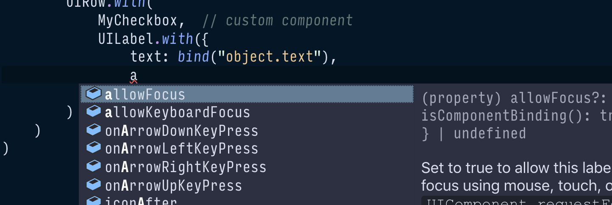

### Components {#components}

At the highest level, a Typescene application is made up of a handful of main building blocks, or _components_.

* __Application__, the component that kicks all the others off.
* __Activities__ represent the current application state and include logic to control the application flow.
* __Views and UI components__ describe what the user sees as a tree structure of nested UI elements.
* __Services__ represent the global state and include logic that can be referenced from other components.

All of these components inherit functionality from the [`Component`](/docs/ref/Component) class, in true object-oriented fashion. Here's what you need to know about components:

__Components are 'managed' objects__, i.e. instances of the `ManagedObject` class, which is Typescene's core data structure. Not all managed objects are components: there are other types of managed objects such as lists and key-object maps.

__Components are arranged into tree structures.__ Parent components reference any number of child components, while each component has at most one parent — enforcing consistency and making it possible to navigate the resulting structure in both directions.

An active composition model binds entire sub-trees of components to a _composite parent_ component. Updates to these composite parents automatically cascade down to _bindings_ at lower levels to update individual properties, e.g. to update a View component from values set on the current Activity.

__Components can emit events.__ Events are read-only objects that are _emitted_ by one component, and can be handled by other components that reference the first one. UI components emit events such as `Click`, `FocusIn` and `FocusOut` to communicate user actions, which can be handled by regular methods on the Activity component.

__Components have 'life cycle' states__, ranging from _created_ (initial state), to _active_, _inactive_, and _destroyed_. Child components are automatically 'destroyed' along with their parent, _or_ if the parent-child reference is reassigned. State transitions are always _asynchronous_, and can be handled using methods on the component class itself, or using events that are emitted automatically.

__Components can be 'preset'__, i.e. pre-populated with property values, bindings (to observe composite parent properties), and event handlers. This way a component class can be _described_ without having to write a constructor or add setters and observers.

To create preset component constructors, the static `.with(...)` method is available on every Component class. It returns _another Component class_, extending the first one.

```typescript
// create a component programmatically:
let button = new UIButton();
button.label = "Click me";

// OR use a preset:
let PresetButton = UIButton.with({ label: "Click me" });
let button2 = new PresetButton();
```

These features make components a very powerful building block for all parts of your application. Typescene leverages components as activities, views, services, and even the application itself.

For a detailed description of how components work, refer to the [Understanding components](/docs/guides/components) guide.

### Activities {#activities}

Typescene manages control flow of the application as a whole using _Activity_ components. Each activity represents a separate 'state' of the application, like a screen, dialog, or URL in a traditional Web app.

Activity components are controlled using _life cycle states_ (i.e. created, active, inactive, destroyed). Moving between activities involves asynchronously inactivating (or destroying) one activity, and activating another.

```typescript
export class AboutPageActivity extends PageViewActivity {
  path = "/about";
  // properties and methods here...

  async onManagedStateActivatingAsync() {
    await super.onManagedStateActivatingAsync();
    // ... runs before the activity is active
  }
}
```

Activity life cycle states can be transitioned manually, or automatically using a URL-like `path` property. The path is matched against the current URL, or some other navigation method as defined by the application component.

Usually, every activity class in the application is referenced directly when starting the application:

```typescript
const app = BrowserApplication.run(
  MainActivity,
  AboutPageActivity,
  SettingsDialogActivity,
  // ... add activities here to add as child components
  // and activate automatically
);
```

For more complex applications, activities can also be loaded _dynamically_, or they can be _nested_, and multiple activities can be active at the same time. The `path` property can also be used to route nested activities and *capture* path segments.

See [Advanced Activities](/docs/guides/activities) for more examples.

### Views {#views}

While Activities are used to model the application's state and behavior, Views describe the user interface (UI). Views are simply components with a `render` method. We _could_ make a view component like this:

```typescript
// one way to create the view, NOT a good one:
export class TodoListView extends Component {
  render(callback: (/* ... */) => void) {
    // create UI components and render those
    // call callback with combined result
  }
}
```

Preset components make for a much easier way to describe view components without actually having to define a new class. The static `.with(...)` method creates a component constructor with predefined properties, bindings, and event handlers, so we can use this method to describe the UI _statically_.

```typescript
let MyButton = UIButton.with({
  dimensions: { minWidth: 250 },
  label: "Click me",
  onClick: "doSomething()"  // activity method
})
```

Some UI components also provide other `.with...` methods, such as [`UILabel.withText`](/docs/ref/UILabel#UILabel:withText) and [`UIImage.withUrl`](/docs/ref/UIImage#UIImage:withUrl). These are simply wrappers around the regular `with` method.

UI components that _contain_ or _control_ other components (such as rows, columns, and lists) can be described using a call to `.with(...)` that includes other constructors as arguments. When the resulting constructor is used to instantiate the view, all of the nested components are created as well.

```typescript
// better way to create a complete View class:
export default UICell.with(
  { dropShadow: .5, /*...*/ },  // properties
  UIRow.with(
    UILabel.withText("To Do")
  ),

  // a list with some to-do items:
  UIListController.with(
    { items: bind("todoItems") },  // binding
    // view adapter for each object:
    UIListCellAdapter.with(
      UIRow.with(
        MyCheckbox,  // custom component
        UILabel.with({
          text: bind("object.text"),
          onClick: "checkTodoItem()"
          // ^ method on the activity class
        })
      )
    )
  )
)
```

Views are usually defined in a separate file, and referenced from a preset activity class which acts as the _composite parent_. The view is only instantiated when the activity is 'active', and the entire tree structure is destroyed again as soon as the activity becomes inactive.

```typescript
// import the view from view/index.ts
import view from "./view";

export class TodoPageActivity
  extends PageViewActivity.with(view) {
  path = "/";

  @managedChild
  todoItems = new ManagedList();

  checkTodoItem(e: UIComponentEvent) {
    // ... handle the event
  }
}
```

To learn more about creating a UI using preset components, refer to 

#### Strongly Typed

Because Typescene is a _strongly typed_ framework, using a TypeScript-aware IDE such as VS Code can be extremely helpful. For example, when you start to type `UIBu`...  the editor will offer to import `UIButton` from the `typescene` package. Type `.with({`, and the editor is able to list all of the properties that can be preset on the `UIButton` component. This not only reduces the amount of typing, but also surfaces documentation on the fly and helps to avoid mistakes.


{:.fullWidthImage}

### Services {#services}

In a real-life application, not all data can be managed inside a single tree structure of activities and views. In those cases, _service_ components can be used, for 'global' state and logic.

Services exist outside of the application/activity components tree, and are instead registered by name (ID). They are loosely coupled to other components using properties that are 'decorated' with the `@service` function, referencing the exact same name.

#### Creating services

To create a service component, extend the `ManagedService` class and call the `register` method on a new instance. Make sure that the service name is unique and not likely to cause confusion once your application grows larger.

```typescript
class LoginService extends ManagedService {
  name = "App.Login";

  // properties and methods here...
  isLoggedIn() { return false; }
}

new LoginService().register();
```

#### Using services

Properties that are decorated with `@service` are automatically assigned to the last service component that has been registered with a particular service name. As soon as another service is registered with that name, the service property will change immediately to reference the new service instead.

```typescript
class MyComponent extends Component {
  @service("App.Login")
  login?: LoginService;  // set automatically

  doSomething() {
    if (this.login && this.login.isLoggedIn()) {
      // ...
    }
  }
}
```

---

#### Next steps

Learn more about [components](/docs/guides/components) to understand how they can be used to structure your data, before moving on to a detailed look at [activities](/docs/guides/activities) and [views](/docs/guides/ui).

For a practical perspective, learn how to [install](/docs/introduction/installation) Typescene and [create a first project](/docs/guides/first).
