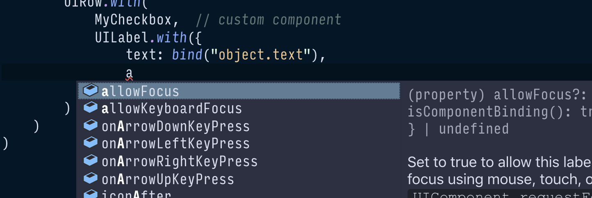

### Components {#components}

At the highest level, a Typescene application is made up of a handful of main building blocks, or _components_.

* __Services__ represent the global state and include logic that can be referenced from other components.
* __Activities__ represent the current application state and include logic to control the application flow.
* __Views and UI components__ describe what the user sees as a tree structure of nested UI elements.

Views are rendered by a separate 'renderer', which is mostly invisible to the component itself. For Web applications, only the renderer interacts directly with the DOM.

Because Typescene is object-oriented, all of these components (services, activities, views, and even the application itself) are defined as classes. These in turn inherit most of their functionality from the [`Component`](/docs/ref/Component) class.

Here's what you need to know about components:

__Components can emit events.__ Events are read-only objects that are _emitted_ by a component. For example, UI components emit events with names such as `Click`, `FocusIn` and `FocusOut` to communicate user actions.

__Components have 'life cycle' states__, ranging from _created_ (initial state), to _active_, _inactive_, and _destroyed_. State transitions are always _asynchronous_, and can be handled using methods on the component class itself, or using events that are emitted automatically.

__Components can be linked together.__ When components reference each other using special 'managed' properties, they can track each other's events and life cycle states. Certain references can be turned into parent-child references, ensuring consistency and making it possible to navigate the resulting tree structure in both directions.

### Views {#views}

Views combine UI components so that they can be rendered to the screen. Typescene provides classes for many basic UI controls and containers, mostly abstracting away the underlying rendering platform (i.e. the DOM for Web applications).

The only requirement for a view to be 'renderable' is that it has a `render` method. So the simplest view class would look something like this:

```typescript
// NOT a good way to create a view component:
export class MyView extends Component {
  render(callback: (/* ... */) => void) {
    // create UI components and render those
    let button = new UIButton("Click me");
    let row = new UIRow(button);
    row.render(callback);
  }
}
```

However, code like this quickly becomes difficult to understand, since there isn't a good way to see the relationships between UI components if we're creating them one by one.

Instead, Typescene offers two ways to create views that work much better.

#### Using JSX

JSX refers to 'XML-in-JavaScript', and is a relatively new feature that's supported by the TypeScript compiler (and Babel, for a JavaScript-only solution).

Typescene provides JSX elements for all of the built-in UI components, such as `<row>` for the UIRow component, and `<button>` for the UIButton component. You can also use your own custom components.

JSX makes views look like HTML, but that's somewhat misleading: each element in JSX is actually transformed to a **view class**, as illustrated below.

```tsx
let MyView = <row spacing={8}><button>OK</button></row>
let row = new MyView();
row.spacing  // => 8
row instanceof UIRow  // => true
```

Our `MyView` variable isn't rendered directly, it's a 'template' that can be used by an Activity (see below) to create and render the actual view only when needed.

To update the resulting view dynamically, we can use **bindings** in place of properties or text. Bindings automatically match up with Activity properties and observe their values for changes.

Event handlers are set up to call methods on the Activity as well, which we can specify by name.

```jsx
let MyView = <form>
  <row><h1>Greeting</h1></row>
  <row>
    <textfield
      placeholder="Enter your name..."
      onInput="updateName()"
      />
  </row>
  <row><p>{bind("greeting")}</p></row>
</form>
```

Whenever an instance of this view is created by an Activity, the values of all bindings are immediately set and kept in sync with properties of the Activity itself (with one caveat: array items cannot be observed, so we'll need to use a special list object instead--see [Understanding components](/docs/guides/components) later on).

#### Using constructor factories

If you don't want to use JSX, or you simply prefer JavaScript/TypeScript for writing your view code, you can create view classes using static _factory methods_.

These methods are available on _any_ component class, not just view components, and can be used to create **constructors** that extend the original class and automatically set any number of properties on every instance.

```typescript
let MyView = UIRow.with(
  { spacing: 8 },
  UIButton.withLabel("Click me")
);
let row = new MyView();
row.spacing  // => 8
row instanceof UIRow  // => true
```

The constructor (class) `MyView` above creates a row `with` 8dp spacing, and a button `with` a given label. The result of these `with` methods is the same as our JSX elements: a template class.

We can use bindings and event handlers with constructor factories as well. Here's the same example as above without JSX.

```typescript
UIForm.with(
  { hidden: bind("hideForm") },
  UIRow.with(UIHeading1.withText("Greeting")),
  UIRow.with(
    UITextField.with({
      placeholder: "Enter your name...",
      onInput: "updateName()"
    })
  ),
  UIRow.with(
    UIParagraph.withText(bind("greeting"))
  )
)
```

Constructor factories and JSX elements are interchangeable, and can even be used together as well:

```tsx
let myView = <row>
    {UIButton.with({
      label: "Hi!",
      onClick() { alert("hi!") }
    })}
</row>
```

#### Strongly Typed

Because Typescene is a _strongly typed_ framework, using a TypeScript-aware IDE such as VS Code can be extremely helpful. For example, when you start to type `UIBu`...  the editor will offer to import `UIButton` from the `typescene` package. Type `.with({`, and the editor is able to list all of the properties that can be preset on the `UIButton` component.

This not only reduces the amount of typing, but also surfaces documentation on the fly and helps to avoid mistakes.


{:.fullWidthImage}

### Activities {#activities}

Beyond the view layer, Typescene applications are broken up into _Activity_ components. Each activity represents a separate 'state' of the application, like a screen, dialog, or URL in a traditional Web app.

Activity components are controlled using _life cycle states_ (i.e. created, active, inactive, destroyed). Moving between activities involves asynchronously inactivating (or destroying) one activity, and activating another.

The `ViewActivity` class can be extended using the `with` method, which is how a view class (usually imported from another file) can be associated with the activity class. When the view activity is activated, it automatically creates a view component instance; deactivating the activity destroys the view again.

```typescript
export default class AboutPageActivity
  extends PageViewActivity.with(view) {
  path = "/about";

  // properties and methods here...

  async onManagedStateActivatingAsync() {
    await super.onManagedStateActivatingAsync();
    // ... runs before the activity becomes active
  }

  async onManagedStateActiveAsync() {
    await super.onManagedStateActiveAsync();
    // ... runs after the activity becomes active
  }
}
```

Activity life cycle states can be transitioned manually, or automatically using a URL-like `path` property. The path is matched against the current URL, or some other navigation method as defined by the application component.

Every activity class in the application should be referenced directly or indirectly by the application class:

```typescript
const app = BrowserApplication.run(
  MainActivity,
  AboutPageActivity,
  SettingsDialogActivity,
  // ... add activities here to add as child components
  // and activate automatically
);
```

For more complex applications activities can be _nested_, or they can be loaded _dynamically_. Multiple activities can be active at the same time. The `path` property can also be used to route nested activities and *capture* path segments.

See [Activities](/docs/guides/activities) for more examples.

### Services {#services}

In a real-life application, not all data can be managed within a single tree structure of activities and views. In those cases, _service_ components can be used, for 'global' state and logic.

Services exist outside of the application/activity components tree, and are instead registered by name (string). They are loosely coupled to other components using properties that are 'decorated' with the `@service` function, referencing the exact same name.

#### Creating services

To create a service component, extend the `ManagedService` class and call the `register` method on a new instance. Make sure that the service name is unique and not likely to cause confusion once your application grows larger.

```typescript
class LoginService extends ManagedService {
  name = "App.Login";

  // properties and methods here...
  isLoggedIn() { return false; }
}

new LoginService().register();
```

#### Using services

Properties that are decorated with the `@service` _decorator_ are automatically assigned to the last service component that has been registered with a particular service name. As soon as another service is registered with that name, the service property will change to reference the new service instead.

```typescript
class MyComponent extends Component {
  @service("App.Login")
  login?: LoginService;  // set automatically

  doSomething() {
    if (this.login && this.login.isLoggedIn()) {
      // ...
    }
  }
}
```

---

#### Next steps

Learn more about [components](/docs/guides/components) to understand how they can be used to structure your data, before moving on to a detailed look at [activities](/docs/guides/activities) and [views](/docs/guides/ui).

For a practical perspective, learn how to [install](/docs/introduction/installation) Typescene and [create a first project](/docs/guides/first).
